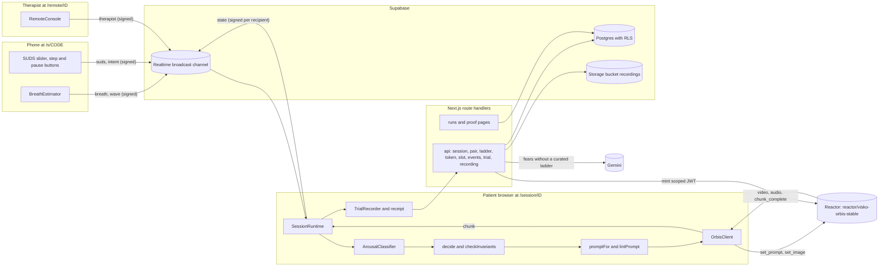
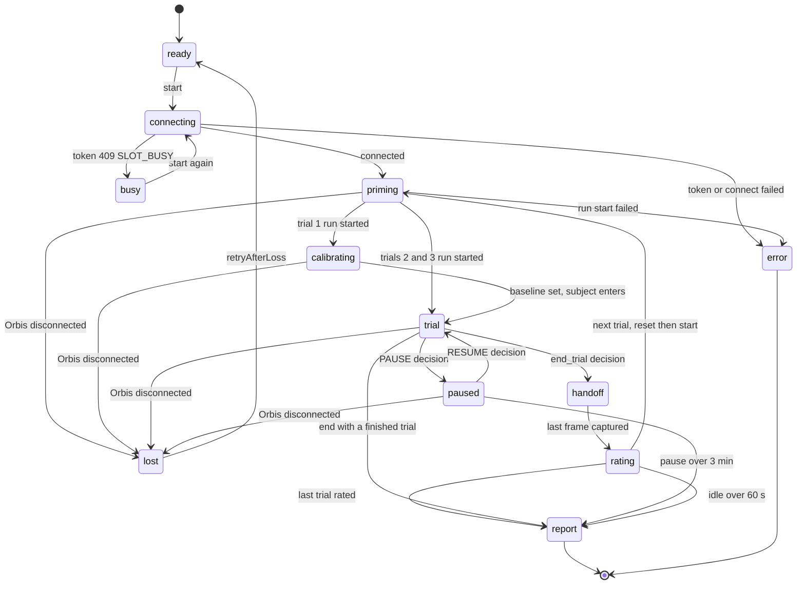

# Architecture

Unflinch runs its decision loop in the patient's browser tab. That tab holds the Orbis connection, receives signed signals from the phone and the therapist, runs the controller on every Orbis chunk, and writes a receipt per trial. The server mints tokens, holds the single Orbis slot lease, builds ladders and stores results. It never touches Orbis video.

## Components

| Component | Where | Role |
|---|---|---|
| Patient player | `app/session/[id]`, `components/player`, `lib/session/runtime.ts` | Owns the Orbis client, the controller state, the recorder and the receipt. |
| Phone sensor | `app/s/[code]`, `components/sensor`, `lib/signal/breath.ts` | Estimates breathing from DeviceMotion and sends it with distress ratings and button intents. |
| Therapist remote | `app/remote/[id]`, `components/remote` | Shows live lanes from signed state and sends signed commands. It has no video. |
| Route handlers | `app/api` | Session creation, pairing, ladder, token and slot lease, events, trials, recordings. |
| Store | `lib/db` | One `Store` interface with a Supabase implementation and a local JSON file implementation (`.data/store.json`). |
| Proof surfaces | `app/(marketing)/proof`, `runs/[id]`, `lib/proof` | Read committed runs from `evidence/live/<id>/`, then stored trials by session id. |

## Data flow

Step by step:

1. `/start` posts to `/api/session`. The server creates a session row with a 6-character pairing code, a `phone_key` and a `remote_key` (32 random bytes each, hex). The browser keeps them in `sessionStorage` under `unflinch:session:<id>`.
2. `/session/[id]` posts to `/api/ladder` and shows the plan.
3. The phone opens `/s/<code>`, posts the code to `/api/pair` and receives the session id and the phone key.
4. Start posts to `/api/token`. The server checks origin, key, kill switch, IP quota and the slot, then returns a Reactor JWT.
5. The browser connects to Reactor with that JWT and runs the start order in `OrbisClient.startRun`: `set_resolution` (1080p if offered, otherwise the first offered, skipped if no list has arrived), `set_audio_enabled`, `set_seed`, optionally upload and `set_image`, `set_prompt` then wait for `conditions_ready`, `start`, then wait for `generation_started`.
6. Phone and remote signals arrive over the realtime channel. Keyboard input and the breath simulator reach the runtime directly in the same tab. Each `chunk_complete` triggers one controller tick.
7. Events flush to `/api/events` every 2 s in batches of up to 200. Each trial's receipt is saved through `/api/trial`. With consent, the recording uploads through a signed URL from `/api/recording`.

## Session runtime lifecycle

`lib/session/runtime.ts` exposes one `SessionRuntime` per session as an external store. Its `Phase` values are the states below.

`end()` also lands in `ended` instead of `report` when no trial has been summarised yet.

Behavior worth knowing:

- Calibration lasts 45 s with a phone, 10 s with the keyboard simulator or ratings only. A phone needs 30 s of confident samples to set a baseline, and the runtime keeps waiting up to 90 s, then falls back to ratings if it still has none.
- After calibration the `enter` prompt is sent as a normal send, so the controller treats it as the last send and respects the landing window.
- Trial length is `min((max_chunks or 229) - 2, 48)` chunks, about 88 s.
- A send is acknowledged when `set_prompt` replies within 2 s. One resend follows a missed ack. A second miss marks the decision `unacked`, shows a message and pauses.
- Landing tracking: a send has landed on the first chunk whose `active_prompt` differs from the previous one (`landed_by: active_prompt`). If chunks carry no `active_prompt`, the boundary after the acknowledgement is recorded as landed and labelled `landed_by: next_boundary`, an inference. If `active_prompt` is present and unchanged more than 4 chunks after the ack, the send is labelled `unlanded`, resent once, and the session pauses if that doesn't land either.
- Handoff: `finalizeTrial` pauses Orbis, captures the last frame (`lib/orbis/handoff.ts`, cropped to 16:9, 854 by 480, JPEG quality 0.9), stops the recorder and shows the rating sheet. The next trial calls `reset`, then `startRun`. The captured frame is passed to `set_image` only when the next trial uses the same ladder context.
- Trial contexts rotate with `contexts[(trial - 1) % contexts.length]`. Dogs has three contexts (park, sidewalk, living room). Heights has one (balcony). A session has 3 trials.
- Timers: events flush every 2 s, the slot heartbeat runs every 60 s, a session ends on `SESSION_CAP` 5 s before the server-issued cap, `PAUSE_TIMEOUT` after 3 min paused, `IDLE` after 60 s on the rating sheet.
- `pagehide` sends `navigator.sendBeacon` to `/api/slot/release`. `teardown` flushes events, calls Orbis `reset`, disconnects and releases the slot.

## Controller (`lib/controller`)

`decide(state, input)` is a pure function. `lib/controller/run.ts` replays a trace through it, which is how the oracle comparison works. The runtime also calls `checkInvariants` on every decision and writes violations into the receipt instead of throwing.

Inputs per tick: `chunkIndex`, `arousal` (UNKNOWN, LOW, WINDOW, HIGH, OVERLOAD), `suds {value, ageS}`, queued `intent` (closer, back, pause, resume, end), `therapist` command (approach, retreat, vary, ev_now, end_trial) and `generationComplete`. Every "chunks since" counter is a chunk-index distance (DECISIONS C1).

Policy values (`lib/controller/policy.ts`):

| Name | Value |
|---|---|
| Minimum chunks between sends | 2 |
| Cooldown after a retreat | 6 chunks |
| Ceiling refire window | 6 chunks |
| SUDS ceiling, low, max age, re-ask | 9, 2, 30 s, 25 s |
| Stable-low streak before auto approach | 6 chunks |
| Vary every, stall nudge after, expectancy hold | 6, 10, 10 chunks |
| Trial max, intent TTL | 48, 6 chunks |
| Overload | rate at least 1.5 x baseline and 24 bpm or more, held 2 chunks, or breath hold 12 s |
| High, low | rate 1.25 x baseline or cv 0.35 or more, rate 1.05 x baseline or less with cv under 0.2 |
| Sensor stale | 5 s |
| Chunk | 33 frames at 18 fps, 1.833 s |

Decision table. First match wins.

| # | Condition | Action | Reason |
|---|---|---|---|
| 1 | pause intent, not paused | pause | PAUSE |
| 2 | paused | resume on a resume intent, else nothing | RESUME or PAUSED |
| 3 | trial chunks at trial max, or generation complete | end trial | TRIAL_MAX |
| 4 | end intent | end trial | PATIENT_END |
| 5 | therapist end_trial | end trial | THERAPIST_END |
| 6 | fewer than 2 chunks since the last send | nothing | LANDING |
| 7 | level above 0, ceiling active, and a new SUDS 9 or 6 chunks since the last ceiling retreat | down 1 | CEILING_SUDS or CEILING_BODY |
| 8 | back intent, level above 0 | down 1 | PATIENT_BACK |
| 9 | therapist retreat, level above 0 | down 1 | THERAPIST_BACK |
| 10 | inside cooldown | hold | COOLDOWN |
| 11 | ceiling active | hold | CEILING_HOLD |
| 12 | no breath class and no fresh SUDS | hold, ask for SUDS | NO_SIGNAL |
| 13 | therapist approach, below cap | up 1 | THERAPIST |
| 14 | closer intent, below cap | self approach 1 | PATIENT_CLOSER |
| 15 | at cap, or therapist ev_now above level 0, and no expectancy test yet | expectancy test | EXPECTANCY_TEST |
| 16 | expectancy test 10 or more chunks ago | end trial | EV_HELD |
| 17 | auto mode, 6 low chunks in a row, below cap | up 1 | UNDER_ENGAGED |
| 18 | 10 chunks at a level below cap, not yet nudged there | nudge, no send | STALL_NUDGE |
| 19 | therapist vary, level above 0 | hold variant | THERAPIST_VARY |
| 20 | 6 chunks since the last send, level above 0 | hold variant | VARIABILITY |
| 21 | otherwise | nothing | IN_WINDOW |

Ceiling active means a fresh SUDS of 9 or more, or an OVERLOAD breath class. A fresh SUDS of 2 or less forces the class to LOW. Breath decides the middle, SUDS decides the extremes.

Differences from the PRD table. Rows 4 and 5 and the PAUSED and ENDED reason codes are additions the PRD leaves open (`tools/README.md`, ambiguities 18 and 19). Therapist `ev_now` and `vary` sit on the PRD rows they ask for (12 and 16) and need a level above 0 (C4, C5). Counters, the low-streak reset and new-SUDS detection follow C1 to C3 and C7 in [DECISIONS](DECISIONS.md).

Invariants. `checkInvariants` evaluates INV1 to INV5 and INV8 on every decision. INV6 holds by the receipt shape and INV7 is enforced at send time.

| ID | Rule |
|---|---|
| INV1 | No up, self approach or expectancy test during a ceiling, a cooldown or no signal |
| INV2 | Level changes by at most 1 and stays within 0 to cap |
| INV3 | At least 2 chunks between sends |
| INV4 | A retreat goes out on the first eligible tick after a new SUDS 9 or an overload onset, and automatic retreats are at least 6 chunks apart unless a new SUDS 9 arrives |
| INV5 | A pause intent is honored on the next tick |
| INV6 | Every send carries a reason code and an input snapshot, which every receipt decision stores |
| INV7 | No prompt contains a lint-banned token. The runtime enforces it at send time. The controller traces carry no prompts, so the oracle reports it as not applicable |
| INV8 | STALL_NUDGE never sends a prompt |

## Ladder pipeline (`lib/ladder`)

A ladder has contexts, each with a safe scene, an `enter` and `exit` action and 4 to 6 levels. Each level has an absolute `state` prompt, `up`, `down`, optional `selfApproach` and 2 to 4 `holds`. The ladder also carries up to 3 expectancy tests (`ev`) and up to 3 therapist-only `deepened` cues. `capOf(context)` is the number of levels, 6 for dogs and 5 for heights.

1. `matchCurated` matches the fear text against keyword patterns. Dogs and heights return a hand-written ladder with no model call.
2. Otherwise `generateLadder` asks `GEMINI_MODEL` (default `gemini-3.8-flash`, then `gemini-3.7-flash` and `gemini-3.5-flash` on overload) for JSON that matches the zod schema, with the fear and feared outcome each cut to 240 characters. The result is parsed, then `lintLadder` checks every string. Failures go back to the model with the lint report. There are 3 attempts in total.
3. With no `GEMINI_API_KEY`, or after 3 failed attempts, `closestCurated` returns heights for place-like words (bridge, elevator, flying, water and similar) and dogs otherwise. The plan screen tells the user a closest hand-written ladder was used (`source: fallback`).
4. `/api/ladder` caches by `sha256(lowercase fear, NUL, lowercase feared outcome)` in the `ladders` table.

Lint (`lib/ladder/lint.ts`) rejects negation words, harm words, people and face words, intent adjectives, and empty text. Absolute prompts need at most 100 words plus a framing phrase and a camera-motion phrase. Transitions need at most 30 words, no "then", at most 2 "and" and at most 2 commas.

At runtime, `promptFor` maps a controller action to a prompt: `up` uses the target level's `up`, `selfApproach` uses its `selfApproach` (falling back to `up`), `down` uses the origin level's `down`, `ev` picks the expectancy test sharing the most words with the feared outcome, and `vary` rotates through `holds` without repeating the last. The start prompt and every transition are linted before they are sent. A failing start prompt aborts the run. A failing transition is dropped and logged as INV7.

## Signal (`lib/signal`)

- `breath.ts` runs on the phone. DeviceMotion samples are resampled to 25 Hz, projected on a rolling principal axis of the gravity vector (20 s window), detrended over 8 s and band-passed at 0.1 to 0.7 Hz. Peaks need a prominence of at least 0.35 x IQR and 1.5 s spacing. Each 500 ms the phone sends `rate` (60 over the median of the last 4 intervals), `cv`, `amp`, `holdS` and `conf`. Confidence drops when rotation exceeds 30 degrees per second or the rate is outside 4 to 45 bpm. A 10 Hz display waveform goes out as 5-sample `wave` messages.
- `arousal.ts` classifies each tick from the latest sample and the baseline. Confidence under 0.5 or a sample older than 5 s is UNKNOWN, never calm. The baseline is the median rate over calibration, accepted only after 30 s of samples at confidence 0.6 or more.
- `sim.ts` is the keyboard simulator: 12 bpm baseline, `S` for 15 s at about 28 bpm with irregular rhythm, `H` for a 15 s hold. Every sample is tagged `source: "sim"` and the receipt carries `SIMULATED_INPUT`.

## Realtime signing (`lib/realtime/channel.ts`)

Channel name is `unflinch:<sessionId>`, event name `m`. The transport is Supabase broadcast when `NEXT_PUBLIC_SUPABASE_URL` and the anon key are set, otherwise a same-browser `BroadcastChannel`.

An envelope is `{type, from, t, payload, sig}`. `sig` is HMAC-SHA256 (WebCrypto) over `type|from|t|JSON(payload)`, keyed with a 32-byte hex key. A receiver drops a message when its sender has no listed key, when `|now - t|` exceeds 10 s, or when the signature fails.

| Messages | Sender | Signed with | Verified by |
|---|---|---|---|
| `breath`, `wave`, `suds`, `intent`, `hello`, `bye` | phone | phone key | patient |
| `therapist`, `hello`, `bye` | remote | remote key | patient |
| `state`, `wave` | patient | remote key to the remote, phone key to the phone (two sends) | remote, phone |

In therapist mode the patient re-signs the phone's `wave` with the remote key so the therapist can verify it. Therapist commands are applied only when the session mode is `therapist`. The therapist link is `/remote/<id>#k=<remote key>`, so the key sits in the URL fragment and is not sent to any server.

## API routes (`app/api`)

| Route | Body | Result and errors |
|---|---|---|
| `POST /api/session` | fear (2 to 240 chars), fearedOutcome, expectancyPre 0 to 100, mode, consent | id, code, codeExpiresAt, phoneKey, remoteKey, seed. 403 `CROSS_ORIGIN` |
| `POST /api/pair` | code | sessionId, phoneKey, fear. 409 `CODE_INVALID` if used or expired |
| `POST /api/ladder` | sessionId, key | ladder, ladderId, source, sha256, lint, cached. Max duration 60 s |
| `POST /api/token` | sessionId, key | jwt, maxSessionS, leaseUntil. 403 `CROSS_ORIGIN`, 404 `SESSION_NOT_FOUND`, 503 `PUBLIC_LIVE_OFF`, 429 `QUOTA`, 409 `SLOT_BUSY`, 503 `REACTOR_NOT_CONFIGURED`, 502 `REACTOR_TOKEN_FAILED` |
| `POST /api/slot/heartbeat` | sessionId, key | `{ok}` or 409 `SLOT_LOST` |
| `POST /api/slot/release` | sessionId, key, end | 204, idempotent, also called by `sendBeacon` |
| `GET /api/slot/status` | none | busy, leaseUntil, publicLive |
| `POST /api/events` | sessionId, key, up to 200 events | 204 |
| `POST /api/trial` | sessionId, key, receipt | id. Upserts by session and trial index |
| `POST /api/recording` | sessionId, key, trial 1 to 20, sha256, bytes up to 500 MB | uploadUrl, token, path. 403 `NO_CONSENT`, 503 `STORAGE_NOT_CONFIGURED` |
| `GET /api/og` | kind and display params | 1200 by 630 PNG |
| `/api/session-cleanup`, `/api/session-registry` | starter | Dev session cleanup. The registry route returns 404 outside development |
| `/api/nano-banana`, `/api/orbis-prompt` | starter | Gemini helpers used only by the `/lab/orbis` playground. 404 in production. |

Token details are in [SECURITY](SECURITY.md). The PRD sketched the token and trial routes without a `key` field. The code requires it on every route except `/api/pair`, `/api/session`, `/api/slot/status` and `/api/og`.

## Data model (`supabase/migrations/0001_init.sql`)

| Table | Purpose |
|---|---|
| `sessions` | One row per session: pairing code and expiry (default 15 min), both keys, mode, fear, feared outcome, expectancy before, ladder id, seed, consent flag, status (`created`, `live`, `ended`) |
| `ladders` | Cached ladders by `fear_hash`, with source and lint report |
| `trials` | One row per trial: context, start and max level, full receipt JSON, recording path and SHA-256 |
| `events` | Batched event log with session id, trial index, millisecond time, kind, payload |
| `orbis_slot` | A single row (id 1) holding the lease holder and expiry |
| `ip_quota` | Sessions per hashed IP per day |

Functions `acquire_slot(holder, lease_s default 600)`, `release_slot(holder)` and `bump_quota(ip_hash, max)` are `security definer`, and execute is revoked from `public`, `anon` and `authenticated`. All six tables have row level security enabled and no policies, so only the service role reads or writes them. The migration also creates a private `recordings` storage bucket. The unique `(session_id, idx)` upsert on trials is done in application code, with no unique constraint behind it.

## Receipts and proof surfaces

A receipt (`unflinch.receipt.v1`, `lib/orbis/receipts.ts`) holds one trial: model, SDK version, seed, resolution, ladder hash and context, start prompt and optional anchor image hash, every chunk with its `active_prompt` and frame count, breath samples per chunk, SUDS reports, every decision with reason, inputs, prompt, `accepted_ms`, landing chunk and outcome, the expectancy test, ratings, recording hash, invariant violations, timing, labels and `ended_by`. The hash shown on `/runs/[id]` is SHA-256 of the canonical JSON (sorted keys), and `/runs/[id]/receipt` serves those same bytes.

- `/runs/[id]` loads `evidence/live/<id>/trial-N.receipt.json` (with optional `run.json`, `cuts.json` and recordings) first. If that folder does not exist it loads stored trials by session id. Committed runs win so a published run never changes.
- `/runs/canonical` redirects to `/runs/<CANONICAL_RUN_ID>` when that variable is set to a valid id, and otherwise shows "No canonical run yet" (P1 in DECISIONS).
- `/proof` renders `evidence/manifest.json` through `lib/evidence/claims.ts`, shows hashes from `evidence/hashes.json` (`pnpm build:evidence`), and lists committed runs plus those of the 10 most recent stored trials that carry the label `SIMULATED_INPUT` or `BUILDER_DEMO`.
- `scripts/verify-receipt.ts` checks a receipt offline.

## Differences from the PRD and known gaps

- Resume after a lost connection restarts the same round as a new take, without calibration. The new take reuses the round's trial index, so its receipt replaces the receipt saved when the connection dropped. The drop is still in the event log.
- A rating left idle for 60 s ends the session and stores that round's receipt with empty ratings.
- An unlanded send is resent once. If the resend doesn't land either, the session pauses and tells the person.
- The "your street" photo anchor (PRD G7) is not in the session flow. The Nano Banana example exists only in the dev playground at `/lab/orbis`.
- `pnpm proof:replay`, `test:live`, `scripts/latency.ts`, `lib/orbis/chunkClock.ts` and `.github/workflows/ci.yml` from the PRD layout do not exist yet.
- The slot is a Postgres lease that coordinates Unflinch sessions only. The app's own 409 and a Reactor `RateLimitedError` on connect both show the busy screen. Other start failures show the error overlay with a link to the recorded run.
